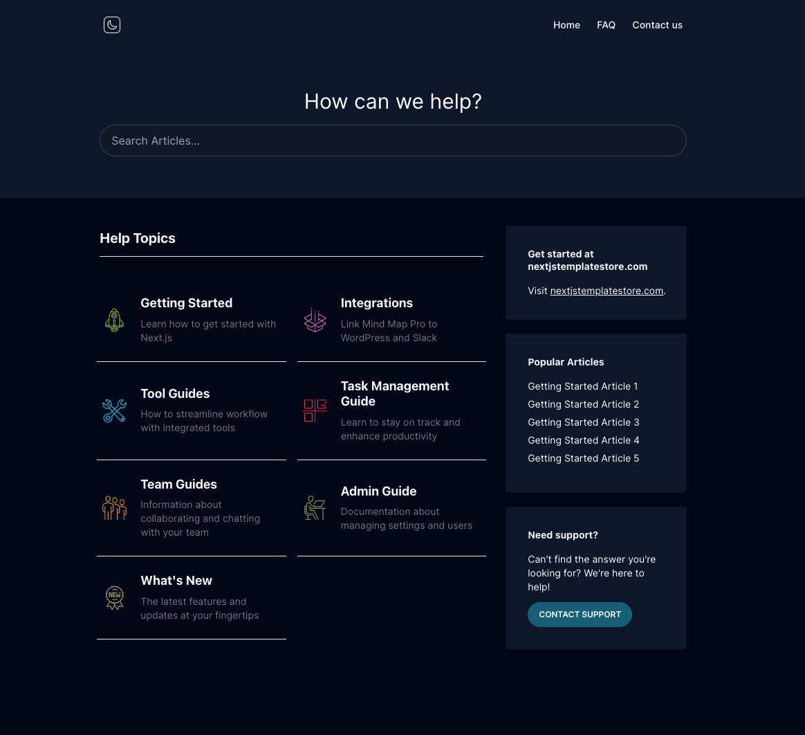
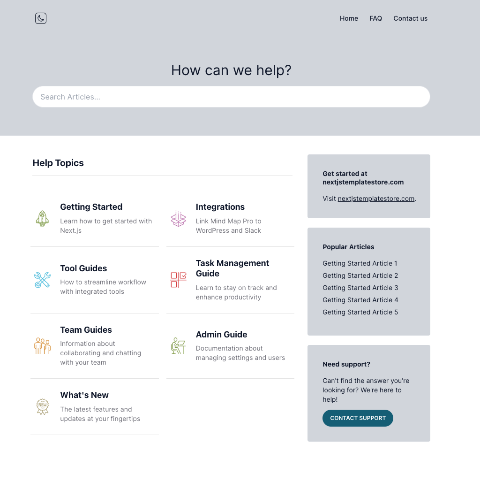

# Knowledge Base

A statically generated knowledge base powered by Next.js 13, TypeScript, TailwindCSS and Contentlayer.




## Features

- Statically generated for optimal performance.
- Detailed search functionality for easy navigation.
- Efficient pagination to effectively manage large volumes of content.
- Dark and Light theme modes to cater to user preferences.
- Responsive design
- Enhanced SEO capabilities.
- Built with TypeScript for type safety and developer productivity.
- Custom styling with Tailwind CSS for an attractive, modern UI.
- Content managed with Contentlayer.

## Getting Started

These instructions will get you a copy of the project up and running on your local machine for development and testing purposes.

[](https://vercel.com/new/clone?repository-url=https%3A%2F%2Fgithub.com%2FUsmanHaider15%2FKnowledge-Base-Nextjs-13)

### Prerequisites

Make sure you have Node.js (v14 or above) and npm installed.

### Installation

1. Clone the repository:

```bash
git clone git@github.com:UsmanHaider15/Knowledge-Base-Nextjs-13.git
```

2. Install the dependencies:

```bash
cd Knowledge-Base-Nextjs-13
yarn install
```

3. Run the development server:

```bash
yarn dev
```

Open [http://localhost:3000](http://localhost:3000) with your browser to see the result.

## Usage

1. Create your knowledge base content in the `content` directory.
2. Use the Contentlayer plugin to manage your data.

## Built With

- [Next.js 13](https://nextjs.org/)
- [TypeScript](https://www.typescriptlang.org/)
- [Tailwind CSS](https://tailwindcss.com/)
- [Contentlayer](https://github.com/contentlayerdev/contentlayer)

## Contributing

Any contributions you make are **greatly appreciated**.

1. Fork the Project
2. Create your Feature Branch (`git checkout -b feature/AmazingFeature`)
3. Commit your Changes (`git commit -m 'Add some AmazingFeature'`)
4. Push to the Branch (`git push origin feature/AmazingFeature`)
5. Open a Pull Request

## License

This project is licensed under the MIT License - see the `LICENSE` file for details.

## Contact

Usman Haider - usman.haider.developer@email.com

Project Link: [https://github.com/UsmanHaider15/Knowledge-Base-Nextjs-13](https://github.com/UsmanHaider15/Knowledge-Base-Nextjs-13)

Feel free to reach out if you have any questions or suggestions!
